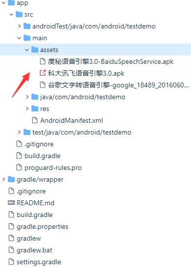

# TTS_demo
一些第三方的TTS引擎库测试

> android上可以将文字转化为音频输出 支持多语种 ，assets里内附有三个引擎库，个人觉得谷歌的最好。




 ```java
 /**
 *  TTS 文字转语音功能
 *  谷歌支持的语种最多
 *  其次百度
 *  测试讯飞的效果最差 可能包有点老了
 *
 *  一般不需要单独设置播放语种  会自动识别 并把语音转化为音频输出
 */
 
 ```
 
 我的手机是小米  内置小米语音TTS  个人觉得厂商内置的更好一些
 
 `借鉴文章：https://blog.csdn.net/yingchengyou/article/details/79591954  十分感谢 `

